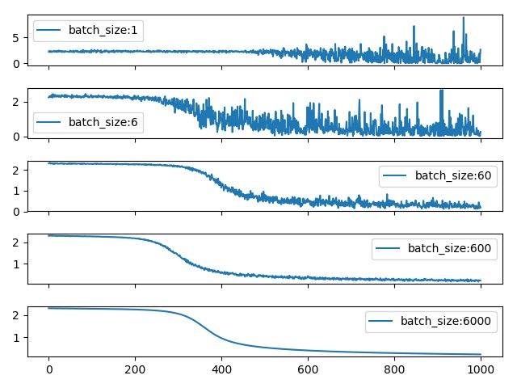

## Batch Size对训练过程的影响

- Full Batch Learning: 每次训练迭代使用所有样本。即batch_size = n_records.
- Online Learning: 每次训练迭代仅使用一个样本。即batch_size = 1.
- Mini-batch Learning: 每次训练迭代使用小批量数据。

**不考虑Batch Normalization**

1. batch size影响每次迭代（iteration）之间的梯度平滑程度。
	- 当batch size太小时，相邻batch间的差距相对过大，则相邻两次迭代的梯度震荡情况会比较严重，不利于模型收敛。*小的batch size，异常值会造成比较大的异常梯度，为了避免对结果造成巨大的扰动，所以使用较小的lr*
	- 当batch size太大时，相邻batch间的差距相对过小，虽然梯度震荡情况会比较小，一定程度上利于模型收敛，但是相邻两个batch的梯度区别太小，整个训练过程就是沿着一个方向往下走，容易陷入到局部最小值。*大的batch size，每次迭代的梯度方向相对固定，为了加速其收敛速度，所以使用较大的lr*

References:
[1] [浅析深度学习中Batch Size大小对训练过程的影响](https://zhuanlan.zhihu.com/p/83626029)